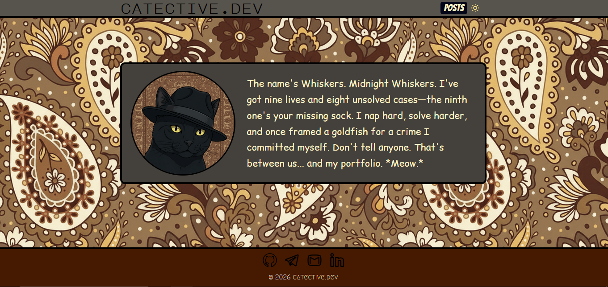

# catective theme

A Hugo blog theme made for detective cats, but humans are also welcome. Design is cool while simple, and it's mobile-first layout. Suited for personal blogs and portfolios. [Check out the Live Demo](https://yasin1ar.github.io/catective-demo/)

# tldr:
- clone the theme: 
    ```
    git clone https://github.com/Yasin1ar/hugo-theme-catective.git themes/catective
    ```
- update the root `hugo.toml`; get inspired by `hugo.toml.example`
- initilize the npm at root and then install `tailwindcss`; get inspired by `package.json.example`. (Move it to your hugo site Root!)
- then: 
    ```
    npm install
    ```
- create scripts at `package.json` like the one I did at `package.json.example`
- build. Run. publish. polish.
     
- Remember your feedback or any contribute is highly, Despreatly welcomed. Since I know nothing about Go lang, and I used a lotta Go code in my project, add me being passimistic about AI (And ME), I believe there are things that could be done better in terms of all. Experts, where are ya?


## Requirements

- **Hugo** extended (for JS/CSS pipelines), 0.120+
- **Node.js** and **npm** (for Tailwind CSS build-from-source)

## Installation

### Option A: Use as submodule

**INSTALL**:

```bash
git submodule add https://github.com/Yasin1ar/hugo-theme-catective.git themes/catective

```
**UPDATE**: at your site's root , run:

```
git submodule update --remote --merge
```

### Option B: Clone into themes

**INSTALL**:

```bash
mkdir -p themes
git clone https://github.com/Yasin1ar/hugo-theme-catective.git themes/catective
```
**UPDATE**: at your site's root:
```bash
cd themes/catective
git pull
```
### Option C: Hugo Module
**INSTALL**:

- Install Go programming language in your operating system.

- Intialize your own hugo mod:

    ```
    hugo mod init YOUR_OWN_GIT_REPOSITORY
    ```

- In your site's hugo.toml
    ```bash
    [module]
    [[module.imports]]
        path = "github.com/Yasin1ar/hugo-theme-catective"
    ```

**UPDATE**:

```
hugo mod get -u
```

## Setup

### 1. Enable the theme

In your site’s `hugo.toml` (or `config.toml`):

```toml
theme = "catective"
```

### 2. Build Tailwind CSS (required)

The theme ships **source** CSS; you must run Tailwind before `hugo`. In your site root, install deps and add a script that points at the theme:

```bash
npm init -y
npm install tailwindcss @tailwindcss/cli
```

In `package.json`:

```json
{
  "scripts": {
    "tailwind:build": "npx tailwindcss -i ./themes/catective/assets/css/main.css -o ./themes/catective/assets/css/style.css --minify",
    "build": "npm run tailwind:build && hugo --minify",
    "build:prod": "npm run tailwind:build && hugo --minify --baseURL \"https://yourdomain.com/\""
  }
}
```

Then run **`npm run tailwind:build`** before **`hugo`** (or use `npm run build` / `npm run build:prod`).

### 3. Theme assets (images and fonts)

- **Images:** The theme expects `favicon.ico`, `yasin-catective.png` (hero image), and `persian-pattern.png` at the site root (from `static/`). Add them to your **site’s** `static/` or to `themes/catective/static/` so they’re included when you share the theme.
- **Fonts:** Add these `.ttf` files into `themes/catective/static/fonts/` (or your site’s `static/fonts/`):
  - `Bangers-Regular.ttf`
  - `Megrim-Regular.ttf`
  - `MajorMonoDisplay-Regular.ttf`
  - `ComicRelief-Regular.ttf`

See `themes/catective/static/fonts/README.md` for details.

## Configuration

Set these in your site’s `hugo.toml` under `[params]` (and optionally in `[params]` in the theme’s `theme.toml` for defaults).

| Parameter | Description | Example |
|-----------|-------------|--------|
| `sitename` | Logo text in header and footer | `"catective.com"` |
| `author` | Your name (hero + meta) | `"Yasin catective"` |
| `author_image` | Filename of hero image in `static/` | `"yasin-catective.png"` |
| `description` | Default meta description | Site blurb |
| `social_github` | GitHub profile URL | `"https://github.com/you"` |
| `social_linkedin` | LinkedIn profile URL | `"https://linkedin.com/in/you"` |
| `social_telegram` | Telegram profile URL | `"https://t.me/you"` |
| `social_email` | Email link | `"mailto:you@example.com"` |
| `google_site_verification` | Google Search Console meta content | Optional |

Example:

```toml
[params]
  sitename = "myblog.dev"
  author = "Your Name"
  author_image = "me.png"
  description = "My personal blog."
  social_github = "https://github.com/you"
  social_linkedin = "https://linkedin.com/in/you"
  social_telegram = "https://t.me/you"
  social_email = "mailto:you@example.com"
```

## Menu

Configure the main menu in `hugo.toml`:

```toml
[[menus.main]]
name = "Posts"
pageRef = "posts"
```

## Content structure

- **Posts:** `content/posts/*.md`
- **Taxonomies:** `categories` and `tags` (configurable via `[taxonomies]`)

## License

MIT

See [LICENSE](LICENSE) in the theme or repo root.
